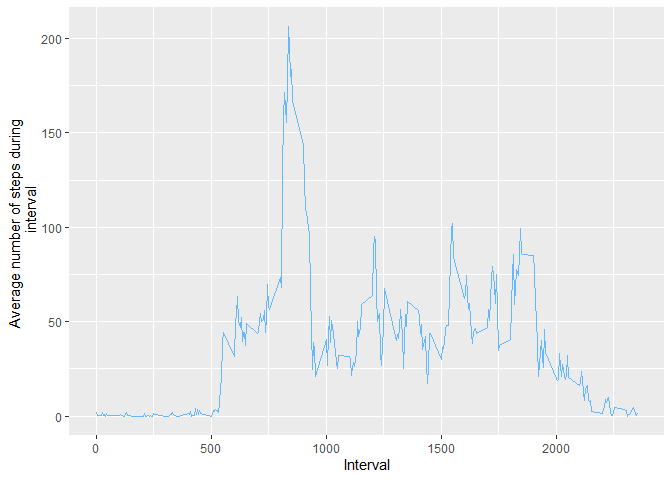
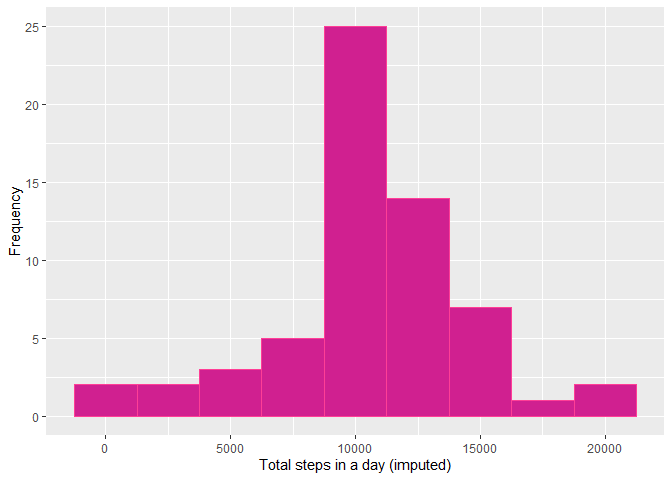
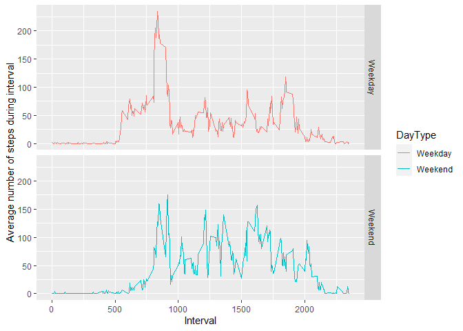

## Loading and preprocessing the data
This section of code sets global options, loads the raw data and processes it
such that steps by interval are aggregated to daily steps.


```r
fileUrl<-"https://d396qusza40orc.cloudfront.net/repdata%2Fdata%2Factivity.zip"
temp<-tempfile() # create a temporary file
download.file(fileUrl,temp) #download file into temporary location
activity<-read.csv(unz(temp,"activity.csv"))
library(dplyr)
activityGrp<-group_by(activity,date)
activityDaily<-summarise(activityGrp,dailystep=sum(steps,na.rm=TRUE))
source("formatNum.R")
```

## What is mean total number of steps taken per day?
The median number of steps taken each day was 
**10,395**, whilst the mean was
**9,354**, when missing values were not
considered. A histogram displays the distribution of total steps in a day below 
.Note that a considerable number of observations had missing 
values, denoted in the 0 bar.


```r
library(ggplot2)
qplot(dailystep,data=activityDaily,ylab="Frequency",xlab="Total steps in a day",
      binwidth=2500,geom="histogram",fill=I("springgreen2"),col=I("springgreen3"))
```


## What is the average daily activity pattern?

```r
activityGrp<-group_by(activity,interval)
activityInt<-summarise(activityGrp,avgstep=mean(steps,na.rm=TRUE))
```
The maximum number of steps on average was observed on the **835th** interval.

```r
qplot(interval,avgstep,data=activityInt,ylab="Average number of steps during 
      interval",xlab="Interval",col=I("steelblue1"),geom="line")
```




## Imputing missing values

```r
totalrows<-nrow(activity)
completerows<-sum(complete.cases(activity))
missingrows<-totalrows-completerows
library(Hmisc)
imputedsteps<-impute(activity$steps,fun=mean(activity$steps,na.rm=TRUE))
activityNew<-activity
activityNew$steps<-imputedsteps
activityGrp<-group_by(activityNew,date)
activityNewDaily<-summarise(activityGrp,dailystep=sum(steps,na.rm=TRUE))
```
The dataset contained many missing values. Out of 
**17,568** observations, only **15,264**
were complete with the remaining **2,304** missing data 
on the number of steps.When missing values were imputed, the median number of 
steps taken each day was **10,766**,
whilst the mean was **10,766**, both
values higher than estimated when excluding missing data.

```r
qplot(dailystep,data=activityNewDaily,ylab="Frequency",xlab="Total steps in a day (imputed)", binwidth=2500,geom="histogram",fill=I("violetred"),col=I("violetred1"))
```




## Are there differences in activity patterns between weekdays and weekends?
The plots below display the average number of steps at different intervals
during weekdays and weekends.

```r
library(lubridate)
activity$date<-ymd(activity$date)
activity$day<-weekdays(activity$date)
activity$dayType<-"Weekday"
activity$dayType[activity$day=="Saturday"]<-"Weekend"
activity$dayType[activity$day=="Sunday"]<-"Weekend"
activityByDayType<-aggregate(activity,by=list(activity$interval,activity$dayType),
                             FUN=mean,na.rm=TRUE)
library(tidyverse)
activityByDayType<-rename(activityByDayType,DayType=Group.2,Interval=Group.1)

qplot(Interval,steps,data=activityByDayType,facets=DayType~.,
ylab="Average number of steps during interval",xlab="Interval",
col=DayType,geom="line")
```




